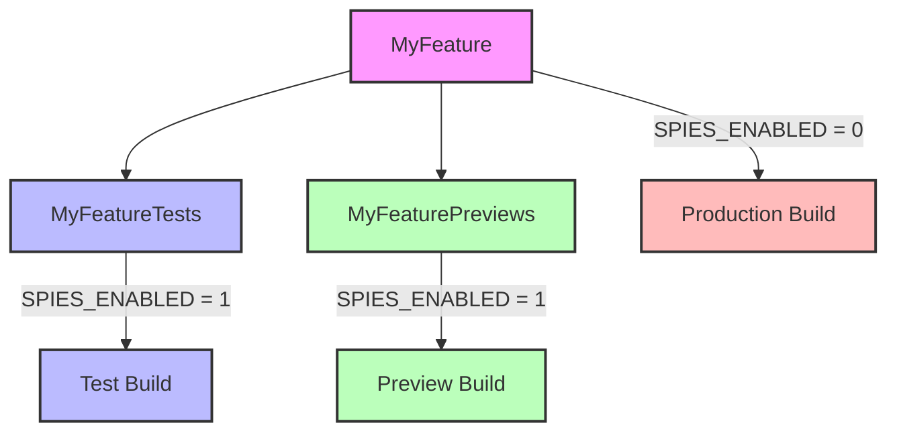

# Spyable


[](https://codecov.io/gh/Matejkob/swift-spyable)
[](https://swiftpackageindex.com/Matejkob/swift-spyable)
[](https://swiftpackageindex.com/Matejkob/swift-spyable)

Spyable is a powerful tool for Swift that simplifies and automates the process of creating spies for testing. By using 
the `@Spyable` annotation on a protocol, the macro generates a spy class that implements the same interface and tracks 
interactions with its methods and properties.

## Overview

A "spy" is a test double that replaces a real component and records all interactions for later inspection. It's 
particularly useful in behavior verification, where the interaction between objects is the subject of the test.

The Spyable macro revolutionizes the process of creating spies in Swift testing:

- **Automatic Spy Generation**: Annotate a protocol with `@Spyable`, and let the macro generate the corresponding spy class.
- **Interaction Tracking**: The generated spy records method calls, arguments, and return values, making it easy to verify behavior in your tests.

## Quick Start

1. Import Spyable: `import Spyable`
2. Annotate your protocol with `@Spyable`:

```swift
@Spyable
protocol ServiceProtocol {
  var name: String { get }
  func fetchConfig(arg: UInt8) async throws -> [String: String]
}
```

This generates a spy class named `ServiceProtocolSpy` that implements `ServiceProtocol`. The generated class includes 
properties and methods for tracking method calls, arguments, and return values.

```swift
class ServiceProtocolSpy: ServiceProtocol {
  var name: String {
    get { underlyingName }
    set { underlyingName = newValue }
  }
  var underlyingName: (String)!

  var fetchConfigArgCallsCount = 0
  var fetchConfigArgCalled: Bool {
    return fetchConfigArgCallsCount > 0
  }
  var fetchConfigArgReceivedArg: UInt8?
  var fetchConfigArgReceivedInvocations: [UInt8] = []
  var fetchConfigArgThrowableError: (any Error)?
  var fetchConfigArgReturnValue: [String: String]!
  var fetchConfigArgClosure: ((UInt8) async throws -> [String: String])?
  func fetchConfig(arg: UInt8) async throws -> [String: String] {
    fetchConfigArgCallsCount += 1
    fetchConfigArgReceivedArg = (arg)
    fetchConfigArgReceivedInvocations.append((arg))
    if let fetchConfigArgThrowableError {
      throw fetchConfigArgThrowableError
    }
    if fetchConfigArgClosure != nil {
      return try await fetchConfigArgClosure!(arg)
    } else {
      return fetchConfigArgReturnValue
    }
  }
}
```

3. Use the spy in your tests:

```swift
func testFetchConfig() async throws {
  let serviceSpy = ServiceProtocolSpy()
  let sut = ViewModel(service: serviceSpy)

  serviceSpy.fetchConfigArgReturnValue = ["key": "value"]

  try await sut.fetchConfig()

  XCTAssertEqual(serviceSpy.fetchConfigArgCallsCount, 1)
  XCTAssertEqual(serviceSpy.fetchConfigArgReceivedInvocations, [1])

  try await sut.saveConfig()

  XCTAssertEqual(serviceSpy.fetchConfigArgCallsCount, 2)
  XCTAssertEqual(serviceSpy.fetchConfigArgReceivedInvocations, [1, 1])
}
```

## Advanced Usage

### Restricting Spy Availability

You can limit where Spyable's generated code can be used by using the `behindPreprocessorFlag` parameter:

```swift
@Spyable(behindPreprocessorFlag: "DEBUG")
protocol MyService {
  func fetchData() async
}
```

This wraps the generated spy in an `#if DEBUG` preprocessor macro, preventing its use where the `DEBUG` flag is not defined.

> [!IMPORTANT]
> The `behindPreprocessorFlag` argument must be a static string literal.

### Xcode Previews Consideration

If you need spies in Xcode Previews while excluding them from production builds, consider using a custom compilation flag (e.g., `SPIES_ENABLED`):

The following diagram illustrates how to set up your project structure with the `SPIES_ENABLED` flag:



Set this flag under "Active Compilation Conditions" for both test and preview targets.

## Examples

Find examples of how to use Spyable [here](./Examples).

## Documentation

The latest documentation is available [here](https://swiftpackageindex.com/Matejkob/swift-spyable/0.1.2/documentation/spyable).

## Installation

### Xcode Projects

Add Spyable as a package dependency:

```
https://github.com/Matejkob/swift-spyable
```

### Swift Package Manager

Add to your `Package.swift`:

```swift
dependencies: [
  .package(url: "https://github.com/Matejkob/swift-spyable", from: "0.3.0")
]
```

Then, add the product to your target:

```swift
.product(name: "Spyable", package: "swift-spyable"),
```

## License

This library is released under the MIT license. See [LICENSE](LICENSE) for details.
